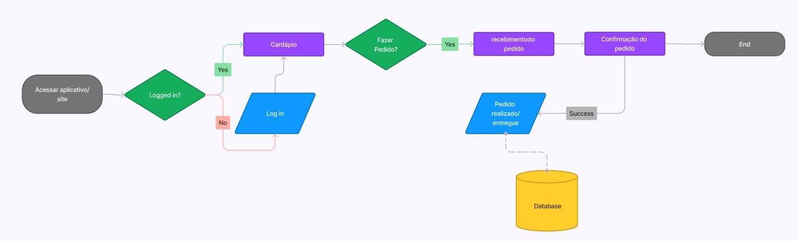
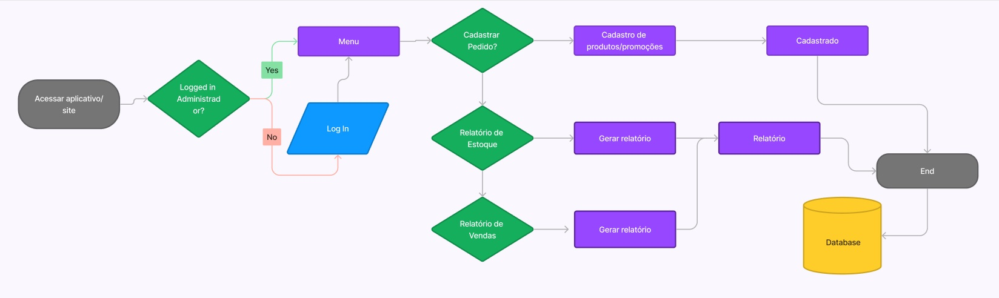
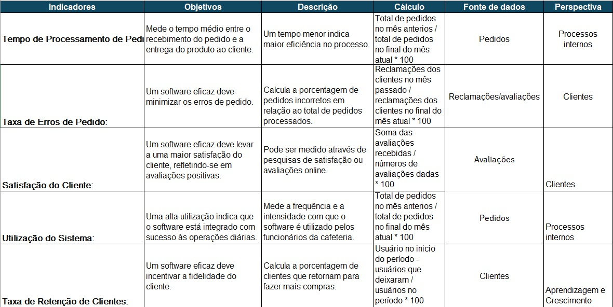
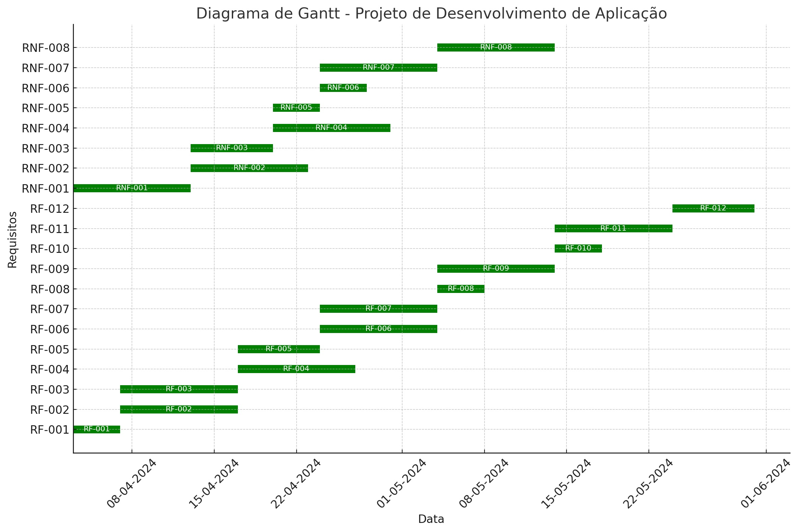
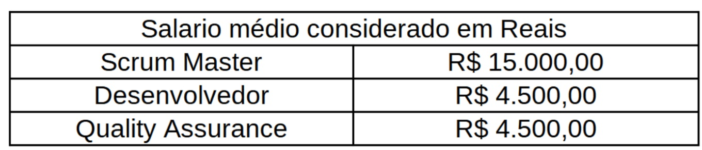
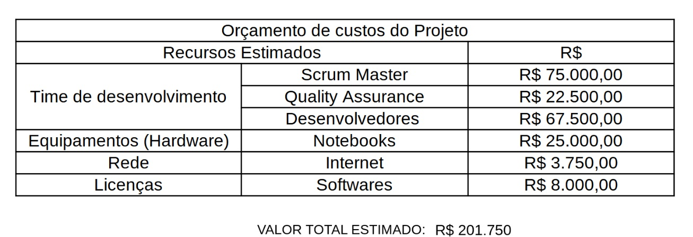

# Especificações do Projeto

## Personas

A persona representa o cliente ideal, sendo um modelo que encapsula todas as características do cliente ideal. Ela é construída com base em dados e atributos de clientes reais, como comportamento, informações demográficas, desafios e objetivos. Portanto, ao definir uma persona, nosso objetivo é compreender os conflitos ou problemas enfrentados pelo cliente, de modo a determinar como o sistema que está sendo projetado pode ajudá-lo.

As personas elaboradas neste projeto abrangem as seguintes características:
 

 

 

 

 

## Histórias de Usuários

Com base na análise das personas forma identificadas as seguintes histórias de usuários:

|EU COMO... `PERSONA`| QUERO/PRECISO ... `FUNCIONALIDADE` |PARA ... `MOTIVO/VALOR`                 |
|--------------------|------------------------------------|----------------------------------------|
|Luana Sousa | Poder ver as imagens dos produtos prontos antes de escolher    | Sou capaz de perceber se a apresentação do produto me agrada. |
|Luana Sousa | Encontrar locais novos que pratiquem a gastronomia inclusiva  | Porque tenho restrições alimentares e não tenho muitas opções confiáveis. |
|Luana Sousa | Ajudar as pessoas a encontrarem opções saborosas e saudáveis    | Não existem muitas opções disponíveis e que sejam de conhecimento amplo. |
|Silvia Almeida | Entrar em contato facilmente com o estabelecimento   | Possa ter um canal direto em caso de necessidade. |
|Silvia Almeida | Encontrar uma cafeteria cujo tempo de entrega não seja tão longo   | Porque as opções que conheço ficam mais distantes da minha casa e tem um tempo de entrega alargado. |
|Tereza Solana | Gerar relatórios sobre as vendas realizadas      | Para que eu consiga ter uma melhor visibilidade do meu negócio |
|Tereza Solana | Ter informações atualizadas sobre meu estoque    | Consiga fazer uma melhor gestão e evitar surpresas que impactam no funcionamento.|
|Tereza Solana | Investir na modalidade de delivery    | Atualmente tenho um alto custo para manter o atendimento presencial. |
|Fábio Gome  | Ter opções de delivery de estabelecimentos que ofereçam comidas sem glúten e lactose  | As opções que conheço só tem atendimento presencial e existem dias que é inviável sair de casa. |
|Fábio Gomes | Ter confiança nos alimentos sem glúten e lactose produzidos pelos restaurantes    | já comi em locais que, apesar de se intitularem inclusivos, na realidade não cuidavam 100% desse aspecto. |
|Fábio Gomes | Apoiar uma causa social de forma constante   | Tenho consciência da quantidade de pessoas que necessitam.|

## Modelagem do Processo de Negócio 

### Análise da Situação Atual

Com o avanço da tecnologia, os softwares de gerenciamento de cafeterias estão se tornando mais sofisticados e integrados. Eles podem incluir recursos como gestão de estoque, controle de vendas, integração com sistemas de pagamento, análise de dados e até mesmo aplicativos móveis para pedidos os online. O mercado de cafeterias no Brasil é altamente competitivo, com muitos estabelecimentos buscando se destacar pela qualidade do produto, atendimento ao cliente, eficiência operacional. Nesse contexto, os softwares de gerenciamento que oferecem soluções eficazes para melhorar a operação e a experiência para o cliente têm uma vantagem bem competitiva.

Tendências atuais no mercado de cafeterias incluem a demanda por produtos orgânicos e sustentáveis, opções de alimentação saudável, experiências personalizadas para os clientes e conveniência, como pedidos online e entregas. Os softwares podem ajudar os estabelecimentos a acompanhar essas tendências, otimizando os processos e oferecendo insights para atender às preferências dos clientes.

Uma tendência crescente é a integração de softwares de gerenciamento de cafeterias com outras plataformas, como aplicativos de entrega de comida, sistemas de fidelidade de clientes e redes sociais. Isso permite uma experiência mais interativa para os clientes e uma gestão mais eficaz para os proprietários de cafeterias.

Em resumo, um software de gerenciamento de cafeteria no Brasil enfrenta um ambiente competitivo e dinâmico, mas também oferece oportunidades significativas para melhorar a eficiência operacional, atender às demandas dos clientes e se destacar no mercado. O oferecimento de uma solução tecnologicamente avançada, fácil de usar e que se adapte às necessidades específicas de cada estabelecimento fará uma grande diferença para o mesmo.

### Descrição Geral da Proposta

O software de gerenciamento de cafeteria é uma ferramenta essencial projetada para simplificar e otimizar todas as operações envolvidas na gestão de uma cafeteria. Com uma interface intuitiva e recursos abrangentes, este software oferece uma solução completa para proprietários e gerentes que desejam aprimorar a eficiência de seus negócios.

### Processo 1 – Usuário/Cliente e suas funcionalidades.

O processo atual (AS IS) tem suas atividades descritas conforme o mapeamento abaixo. No entanto, foram identificadas oportunidades de melhoria, como atividades predominantemente manuais e centralizadas em um único indivíduo, pois muitas cafeterias ainda usam do atendimento no WhatsApp, ocorrendo assim um alto volume de comunicação, o que aumenta o risco de perda de informações, por isso a questão de um sofwatre de gerenciamento, é a melhor opção. 

### Processo 2 – Administrador/Funcionário e suas funcionalidades.

O processo atual (AS IS) tem suas atividades descritas conforme o mapeamento abaixo. Muitas cafeterias frequentemente gerenciam seus estabelecimentos de forma manual, o que resulta em processos dispendiosos, ineficientes e propensos a erros.

## Indicadores de Desempenho

## Requisitos

O escopo funcional do projeto é delineado pelos requisitos funcionais, os quais detalham as diversas interações dos usuários, e pelos requisitos não funcionais, que descrevem os aspectos gerais que o sistema deve apresentar. A seguir, apresentamos esses requisitos.

### Requisitos Funcionais

A tabela a seguir lista os requisitos do projeto, indicando a ordem de prioridade para sua entrega.

|ID    | Descrição do Requisito  | Prioridade |
|------|-----------------------------------------|----|
|RF-001| A aplicação deve apresentar na página principal informações sobre a história da cafeteria | BAIXA | 
|RF-002| A aplicação deve apresentar, para cada produto, uma imagem correspondente. (thumbnail)  | ALTA |
|RF-003| A aplicação deve permitir ao usuário visualizar o cardápio completo do estabelecimento com todos os detalhes dos ingredientes  | ALTA |
|RF-004| A aplicação deve permitir ao gestor cadastrar, alterar e remover os produtos   | ALTA |
|RF-005| A aplicação deve permitir que o usuário adicione e remova promoções  | MÉDIA |
|RF-006| A aplicação permite que o usuário realize os seus pedidos diretamente por ele  | ALTA |
|RF-007| A aplicação deve oferecer ao gestor uma funcionalidade de relatório de estoque dos produtos   | ALTA |
|RF-008| A aplicação deve permitir visualizar as informações de contatos do mantenedor do site   | BAIXA |
|RF-009| A aplicação deve oferecer ao gestor uma funcionalidade de relatório de vendas   | ALTA |
|RF-010| A aplicação deve permitir que qualquer usuário possa se cadastrar no site   | BAIXA |
|RF-011| A aplicação deve permitir que os usuários realizem seus pedidos após a realização do login   | ALTA |
|RF-012| A aplicação deve permitir o cadastro e atualização dos produtos de estoque pelos funcionários | MÉDIA |

### Requisitos não Funcionais

A tabela abaixo enumera os requisitos não funcionais que o projeto deve cumprir:

|ID     | Descrição do Requisito  |Prioridade |
|-------|-------------------------|----|
|RNF-001| A aplicação deve ser publicada em um ambiente acessível publicamente na Internet (Repl.it, GitHub Pages, Heroku) | ALTA | 
|RNF-002| A aplicação deverá ser responsiva permitindo a visualização em diferentes telas de forma adequada |  ALTA |
|RNF-003| A aplicação deve ter bom nível de contraste entre os elementos da tela em conformidade |  ALTA |
|RNF-004| A aplicação deve ser compatível com os principais navegadores do mercado (Google Chrome, Firefox, Microsoft Edge) |  ALTA |
|RNF-005| A aplicação não permite o recebimento de cadastros de usuários com dados necessários em branco |  ALTA |
|RNF-006| A aplicação deverá informar o erro de cadastro e login para o usuário caso os dados inseridos não estejam no banco de dados |  ALTA |
|RNF-007| A aplicação deverá realizar backup dos dados principais de cadastros dos clientes para um banco de dados em nuvem |  ALTA |
|RNF-008| A aplicação será desenvolvida através das linguagens JavaScript e TypeScript e utilizar como armazenamento dos dados o banco de dados Firestore do Google |  ALTA |

## Restrições

As questões que impõem limitações à execução deste projeto e que representam diretrizes claras para seu desenvolvimento são apresentadas na tabela a seguir:

|ID| Restrição                                             |
|--|-------------------------------------------------------|
|01| O projeto deverá ser entregue até o final do semestre letivo |
|02| A aplicação distrubuída deve se restringir às linguagens JavaScritp e TypeScript e ao banco de dados Firestore   |
|03| A equipe não pode subcontratar o desenvolvimento do trabalho    |
|04| A aplicação distribuída não deve demandar pagamento   |

## Diagrama de Casos de Uso

O diagrama de casos de uso abaixo resume as interações dos atores com a aplicação:
 

# Matriz de Rastreabilidade

A matriz de rastreabilidade é uma ferramenta usada para facilitar a visualização dos relacionamento entre requisitos e outros artefatos ou objetos, permitindo a rastreabilidade entre os requisitos e os objetivos de negócio. 

link para documentação no excel: https://sgapucminasbr-my.sharepoint.com/:x:/g/personal/1425096_sga_pucminas_br/EROsgkA4qt9NjJpohiLB5kABB5TeAmVp67UJxjqTb_D4gw?e=SmPeOU

# Gerenciamento de Projeto

De acordo com o PMBoK v6 as dez áreas que constituem os pilares para gerenciar projetos, e que caracterizam a multidisciplinaridade envolvida, são: Integração, Escopo, Cronograma (Tempo), Custos, Qualidade, Recursos, Comunicações, Riscos, Aquisições, Partes Interessadas. Para desenvolver projetos um profissional deve se preocupar em gerenciar todas essas dez áreas. Elas se complementam e se relacionam, de tal forma que não se deve apenas examinar uma área de forma estanque. É preciso considerar, por exemplo, que as áreas de Escopo, Cronograma e Custos estão muito relacionadas. Assim, se eu amplio o escopo de um projeto eu posso afetar seu cronograma e seus custos.

## Gerenciamento de Tempo

Cronograma de Execução e Requisitos

## Requisitos Funcionais
- **Alta Prioridade:** RF-002, RF-003, RF-004, RF-006, RF-007, RF-009, RF-011
- **Média Prioridade:** RF-005, RF-012
- **Baixa Prioridade:** RF-001, RF-008, RF-010

## Requisitos Não Funcionais
- **Alta Prioridade:** RNF-001, RNF-002, RNF-004, RNF-007, RNF-008
- **Média e Baixa Prioridade:** RNF-003, RNF-005, RNF-006

## Cronograma Sugerido
- **Semana 1-4 (03/04 - 30/04):** Desenvolvimento dos requisitos funcionais de alta prioridade.
- **Semana 5 (01/05 - 07/05):** Testes e ajustes para requisitos funcionais de alta prioridade.
- **Semana 6-7 (08/05 - 21/05):** Desenvolvimento dos requisitos funcionais de média prioridade.
- **Semana 8 (22/05 - 28/05):** Testes e ajustes para requisitos funcionais de média prioridade.
- **Semana 9 (29/05 - 04/06):** Desenvolvimento e testes dos requisitos funcionais de baixa prioridade.
- **Semana 10-11 (05/06 - 18/06):** Implementação dos requisitos não funcionais de alta prioridade.
- **Semana 12 (19/06 - 25/06):** Testes de compatibilidade e acessibilidade para requisitos não funcionais de alta prioridade.
- **Semana 13 (26/06 - 02/07):** Implementação dos requisitos não funcionais de média e baixa prioridade.
- **Semana 14 (03/07 - 09/07):** Testes e ajustes finais, preparação para o lançamento.

## Gerenciamento de Equipe

 A equipe foi organizada, conforme abaixo, da seguinte maneira:

Scrum Master: Leticia Pauli

Product Owner: Douglas Zoccarato 

Equipe de Desenvolvimento:

Gustavo Santos,
Matheus Rios,
Remilton Junior.

## Gestão de Orçamento
A gestão de orçamento diz respeito à previsão, alocação e controle dos custos do projeto. Inicia-se com a elaboração de um orçamento detalhado, baseado nas necessidades do projeto e nos recursos disponíveis. Foi desenvolvido para o projeto uma estimativa variável com os custos médios do projeto.

Foi especificado com base no site Glassdoor.com uma média de salarios mensais para estimar os custos:

Assim foi projetado a estimativa de custos finais do Projeto com duração de 5 meses, onde a equipe conta com um Scrum Master, um Quality Assurance, e três Desenvolvedores:

