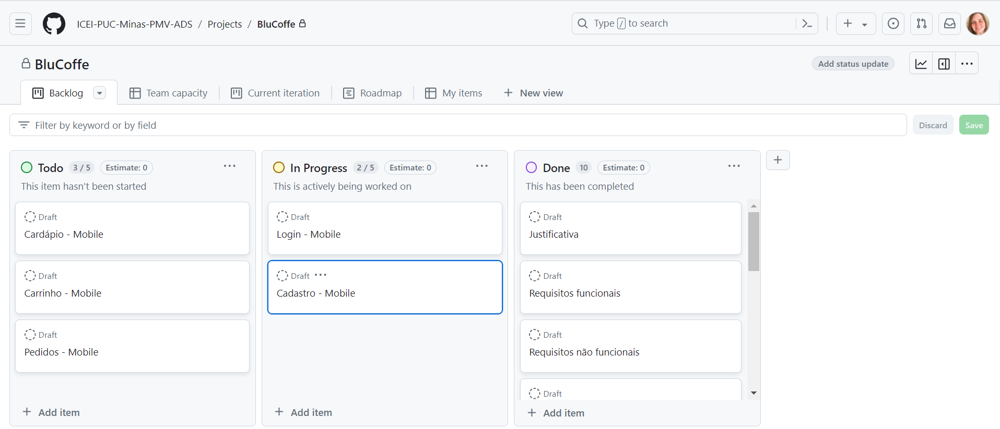
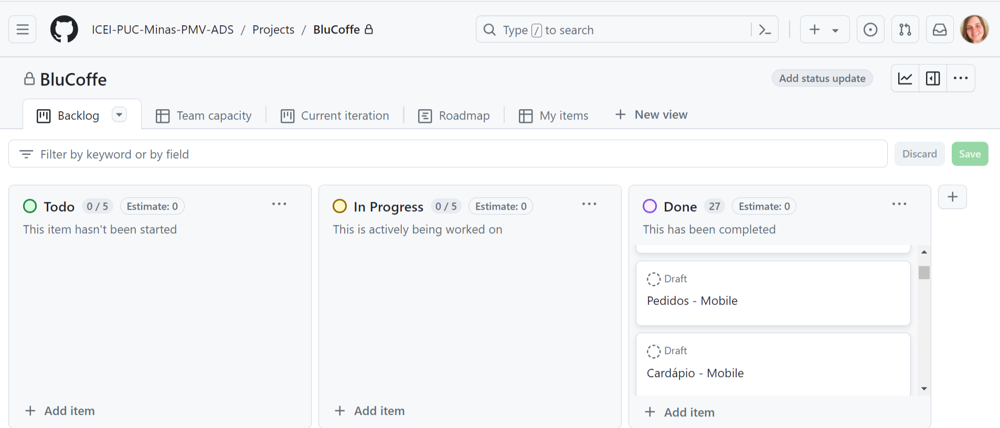

# Metodologia

Nesta seção estão contempladas as definições de ferramentas utilizadas pela equipe tanto para a manutenção dos códigos e demais artefatos quanto para a organização do time na execução das tarefas do projeto.

## Relação de Ambientes de Trabalho

Os artefatos do projeto serão desenvolvidos a partir das plataformas listadas abaixo:

|Ambiente                       |Plataforma  |Link de acesso                                                                                                          |
|---------------------------    |----------  |------------------------------------------------------------------------------------------------------------------------|
|Repositório de código-fonte    |GitHub      |[GitHub](https://github.com/ICEI-PUC-Minas-PMV-ADS/pmv-ads-2024-1-e4-proj-infra-t5-pmv-ads-2024-1-e4-proj-infra-t5-grupo01/tree/main)|
|Documentos do projeto          |Google Docs|[Google Docs](https://docs.google.com/document/d/1KvXyCyd7VwPn308cMu5XoW9Syf9pnWuBRs-b3akDa5w/edit)                               | 
|Gerenciamento do projeto       | GitHub    |[GitHub]()                               |
|Gerenciamento de diagramas     | InvisionApp |[InvisionApp](https://leticiapauli6777.invisionapp.com/freehand/BluCoffe-jueylP5Vi)                                                  | 
|Gerenciamento de wireframes    | InvisionApp |[InvisonApp](https://leticiapauli6777.invisionapp.com/freehand/BluCoffe-jueylP5Vi)                       | 
|Gerenciamento do banco de dados|Firebase| [Firebase](https://console.firebase.google.com/project/blucoffee-ae7ef/overview)                                                                            |
|Gerenciamento de código-fonte|GitHub|    [GitHub](https://github.com/ICEI-PUC-Minas-PMV-ADS/pmv-ads-2024-1-e4-proj-infra-t5-pmv-ads-2024-1-e4-proj-infra-t5-grupo01/tree/main)                                                                                                                |
|Serviço de hospedagem da aplicação|Web - AZURE / Mobile - LocalHost|[XXXXXX](xxxxxx)           

## Controle de Versão

A ferramenta de controle de versão adotada no projeto foi o
[Git](https://git-scm.com/), sendo que o [Github](https://github.com)
foi utilizado para hospedagem do repositório.

O projeto segue a seguinte convenção para o nome de branches:

- `main`: versão estável já testada do software
- `unstable`: versão já testada do software, porém instável
- `testing`: versão em testes do software
- `dev`: versão de desenvolvimento do software

Quanto à gerência de issues, o projeto adota a seguinte convenção para
etiquetas:

- `documentation`: melhorias ou acréscimos à documentação
- `bug`: uma funcionalidade encontra-se com problemas
- `enhancement`: uma funcionalidade precisa ser melhorada
- `feature`: uma nova funcionalidade precisa ser introduzida

Discuta como a configuração do projeto foi feita na ferramenta de versionamento escolhida. Exponha como a gerência de tags, merges, commits e branchs é realizada. Discuta como a gerência de issues foi realizada.

> **Links Úteis**:
> - [Microfundamento: Gerência de Configuração](https://pucminas.instructure.com/courses/87878/)
> - [Tutorial GitHub](https://guides.github.com/activities/hello-world/)
> - [Git e Github](https://www.youtube.com/playlist?list=PLHz_AreHm4dm7ZULPAmadvNhH6vk9oNZA)
>  - [Comparando fluxos de trabalho](https://www.atlassian.com/br/git/tutorials/comparing-workflows)
> - [Understanding the GitHub flow](https://guides.github.com/introduction/flow/)
> - [The gitflow workflow - in less than 5 mins](https://www.youtube.com/watch?v=1SXpE08hvGs)

## Gerenciamento de Projeto

### Divisão de Papéis

Em relação à dinâmica de organização da equipe, adotamos a realização de duas reuniões semanais entre os membros, além de uma reunião semanal com o professor orientador para apresentação das entregas, avaliação e possíveis ajustes, bem como orientações para as próximas etapas. As reuniões são estruturadas da seguinte forma:
Reunião semanal com o Professor Orientador, realizada às terças-feiras às 18h na plataforma Teams, com gravação sempre que necessário.
Reunião entre os membros da equipe, geralmente às sextas-feiras às 16:00 na plataforma Teams. Nessa reunião, são discutidos os ajustes sugeridos pelo Professor na reunião anterior, bem como a divisão de tarefas para a próxima entrega.
Reunião entre os membros da equipe, normalmente às segundas-feiras às 16:00 na plataforma Teams. Neste encontro, são apresentadas as produções definidas na reunião anterior e feitos os ajustes necessários para a entrega da semana seguinte.
Para o gerenciamento do projeto, implementamos quadros Kanban na ferramenta Trello para cada sprint semanal, tornando o progresso do trabalho visível para toda a equipe. Isso cria um indicador visual que permite determinar se uma nova atividade pode ou não ser iniciada e se o prazo acordado está sendo seguido. Para organizar e distribuir as atividades do projeto, estruturamos o Trello com as seguintes listas:
Backlog: atividades a serem trabalhadas;
To Do: atividades da sprint atual;
Doing: atividades iniciadas e em andamento;
Done: atividades concluídas e prontas para entrega.

Apresente a divisão de papéis entre os membros do grupo.

Exemplificação: A equipe utiliza metodologias ágeis, tendo escolhido o Scrum como base para definição do processo de desenvolvimento. A equipe está organizada da seguinte maneira:

- Scrum Master: Leticia Pauli;
- Product Owner: Douglas Zoccarato;
- Equipe de Desenvolvimento: Gustavo Santos, Matheus Rios;
- Equipe de Design: Leticia Pauli.

> **Links Úteis**:
> - [11 Passos Essenciais para Implantar Scrum no seu Projeto](https://mindmaster.com.br/scrum-11-passos/)
> - [Scrum em 9 minutos](https://www.youtube.com/watch?v=XfvQWnRgxG0)
> - [Os papéis do Scrum e a verdade sobre cargos nessa técnica](https://www.atlassian.com/br/agile/scrum/roles)

### Processo

Para desenvolver um software de gerenciamento de cafeteria envolve uma série de etapas e processos cuidadosamente planejados para criar uma solução eficaz e adaptada às necessidades específicas desse setor. O processo pode ser dividido em várias fases, desde a concepção da ideia até a implementação e manutenção do produto final.

1. Levantamento de Requisitos: A primeira etapa do processo envolve compreender completamente as necessidades dos clientes e as demandas do mercado de cafeterias. Isso inclui a realização de pesquisas de mercado, entrevistas com proprietários de cafeterias e análise de concorrentes para identificar funcionalidades essenciais e recursos desejáveis.

2. Design e Prototipagem: Com base nos requisitos levantados, os designers de UX/UI criam esboços, wireframes e protótipos do software. Esse processo permite visualizar como será a interface do usuário e validar o fluxo de navegação antes da implementação.

3. Desenvolvimento do Software: Os desenvolvedores trabalham para transformar os designs e protótipos em um software funcional. Isso envolve a codificação das funcionalidades, integração com sistemas de pagamento, desenvolvimento de aplicativos móveis (se aplicável) e implementação de recursos de segurança.

4. Testes e Qualidade: Antes do lançamento, o software passa por rigorosos testes de qualidade para garantir que todas as funcionalidades estejam funcionando corretamente e que não haja bugs ou falhas. Isso inclui testes de unidade, integração, sistema e aceitação do usuário.

5. Lançamento e Implementação: Uma vez que o software tenha sido testado e aprovado, ele está pronto para o lançamento. Durante essa fase, o software é implantado nos sistemas dos clientes, e a equipe de suporte oferece treinamento e assistência para garantir uma transição suave.

6. Monitoramento e Manutenção: Após o lançamento, o software é continuamente monitorado para garantir seu desempenho e segurança. As atualizações e correções de bugs são lançadas conforme necessário para manter o software funcionando de forma eficiente e atender às necessidades em evolução dos clientes.

7. Feedback e Melhoria Contínua: O processo de desenvolvimento não termina com o lançamento. A equipe continua a coletar feedback dos usuários e a realizar melhorias incrementais com base nesse feedback para garantir que o software permaneça relevante e competitivo no mercado de cafeterias em constante mudança.

Desenvolver um software de gerenciamento de cafeteria é um processo complexo que requer colaboração entre designers, desenvolvedores, especialistas em qualidade e equipes de suporte para criar e manter uma solução eficaz e centrada no cliente.

### Ferramentas

As ferramentas empregadas no projeto serão:

Repositório de Código Fonte: Github  
Gerenciamento do Projeto: GitHub  
Ferramenta de Comunicação: Aplicativo Teams  
Editor de Código: VScode  
Ferramentas de desenho de telas, diagramas e fluxogramas: poderão ser usados o LucidChart, InvisionApp e o Figma. 
