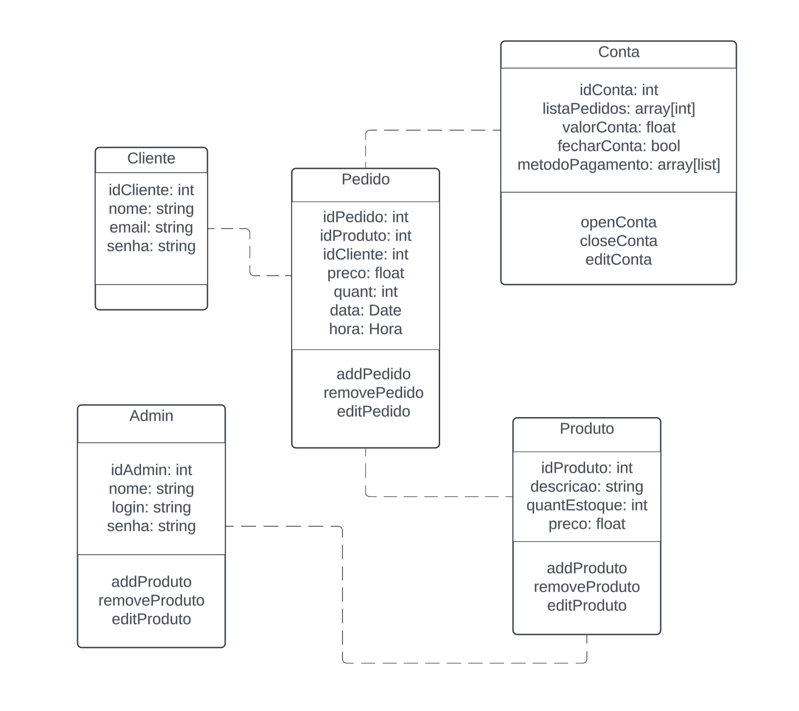

# Arquitetura da Solução

Pré-requisitos: <a href="3-Projeto de Interface.md"> Projeto de Interface</a>

Definição de como o software é estruturado em termos dos componentes que fazem parte da solução e do ambiente de hospedagem da aplicação.

## Diagrama de Classes

O diagrama de classes utilizado é similar a um sistema POS (point of sales) onde o usuário pode realizar seus pedidos de produtos localmente, o estabelecimento cadastrar produtos e assim é gerado um pedido que em conjunto são atrelados a uma conta daquele usuário. Ainda, cabe fechar a conta e definir os meios de pagamento.

## Modelo ER

O Modelo ER representa através de um diagrama como as entidades (coisas, objetos) se relacionam entre si na aplicação interativa.

## Esquema Relacional

## Modelo Físico 

Nosso banco NoSQL está estruturado dentro da solução em nuvem Firestore do ecossistema Firebase. 
https://firebase.google.com/docs/firestore?hl=pt-br

## Tecnologias Utilizadas
Tecnologias Utilizadas
Segue as tecnologias que foram utilizadas para a realização (desenvolvimento) desta aplicação distribuída.

### Linguagens de programação utilizada:

#### Desenvolvimento do backend:
- Java
#### Desenvolvimento do frontend:
Front Web:
- Framework: React
- HTML: Linguagem de marcação utilizada para estruturar e criar o conteúdo da web.  
- CSS: Linguagem de folha de estilo utilizada para formatar e estilizar páginas criadas com HTML. 
- JavaScript: Linguagem utilizada para adcionar interatividade e dinamismo da página web. 
#### IDE utilizada:  
- Visual Studio Code  
- Intellij  
#### Banco NoSQL utilizado:   
- Google Firestore
- MongoDB: Escolhemos este software devido ao fato de que cuida do armazenamento, atualização e recuperação de dados computacionais, permitindo toda esta administração de forma remota (através de rede / internet). 
#### Outras tecnologias utilizadas: 
Lucidchart: Ferramenta utilizada para o design dos diagramas. 
GitProjects: Ferramenta utilizada para realizar a gestão das tarefas do projeto. 
Canva: Ferramenta utilizada para criar as personas do projeto. 
InvisionApp: Ferramenta utilizada para criar os wireframes do projeto.

Apresente também uma figura explicando como as tecnologias estão relacionadas ou como uma interação do usuário com o sistema vai ser conduzida, por onde ela passa até retornar uma resposta ao usuário.

## Hospedagem

A aplicação mobile será executada no AndroidStudio, em local host, e a aplicação Web será executada no Microsoft Azure.

## Qualidade de Software

Com o objetivo de avaliar a qualidade do software desenvolvido, as seguintes características e subcaracterísticas da ISO/IEC 25010 foram selecionadas como parâmetros para o projeto:

1- ADEQUAÇÃO FUNCIONAL:
Essa característica se refere à capacidade do software de realizar o que se propõe a fazer.

1.1) Integridade funcional: cobertura de todas as tarefas e objetivos.

2- EFICIÊNCIA DE DESEMPENHO:
Esse atributo está relacionado à performance do software.

2.1) Comportamento temporal: tempo de resposta e processamento.

Nessa etapa, espera-se que o aplicativo possua um tempo de resposta e processamento aceitável, sem que o usuário precise esperar muito tempo para realizar suas ações.

3- COMPATIBILIDADE:
É a capacidade do produto ou do sistema de trocar informações, assim como de realizar funções enquanto compartilha um hardware.

3.1) Coexistência: capacidade de realizar funções eficientemente enquanto compartilha um ambiente ou recursos com outros produtos.

Essa característica e a subcaracterística serão importantes para identificar se a utilização do aplicativo pode se dar em paralelo com outras atividades do sistema.

4- USABILIDADE:
É a capacidade do sistema realizar objetivos eficientemente, efetivamente e de maneira satisfatória.

4.1) Capacidade de aprendizado: facilidade de aprender como utilizar o sistema;

4.2) Proteção de erro do usuário: capacidade do produto proteger o usuário de erros. O aplicativo deve ser o mais intuitivo possível e também possuir informações explícitas onde possa encontrar alguma dificuldade;
4.3 - Estética da interface de usuário: agradabilidade da interface;

4.3) Estética da interface de usuário: agradabilidade da interface;

4.4) Acessibilidade: capacidade do sistema ser utilizado por pessoas com características e capacidades diversas.

5- CONFIABILIDADE:
O quão bem o produto realiza funções específicas sob condições específicas.

5.1) Maturidade: capacidade do produto atingir as necessidades de confiabilidade;

5.2) Disponibilidade: Se o sistema está acessível e operante.

6- SEGURANÇA:
Capacidade do sistema proteger informação e dados vulneráveis.

6.1) Confidencialidade: sistema tem que ser capaz de garantir que dados são acessados apenas por aqueles que tem acesso autorizado;

6.2) Integridade: capacidade de prevenir acesso não-autorizado e modificação de dados ou programas de computador.

7- MANUTENIBILIDADE:
É a característica que engloba a capacidade de um sistema ser modificado, atualizado e adaptado às mudanças de ambiente e requerimentos.

7.1) Modularidade: o sistema pode sofrer mudanças sem impactar em outros componentes;

7.2) Reusabilidade: capacidade de um recurso poder ser utilizado em mais de um sistema;

7.3) Modificabilidade: capacidade do sistema ser modificado sem introduzir defeitos ou diminuir a qualidade do atual;

7.4) Testabilidade: efetividade de testes para o sistema.

8- PORTABILIDADE:
Capacidade do sistema ser transferido de um ambiente para outro.

8.1) Facilidade de instalação: capacidade do sistema ser instalado ou desinstalado facilmente.
