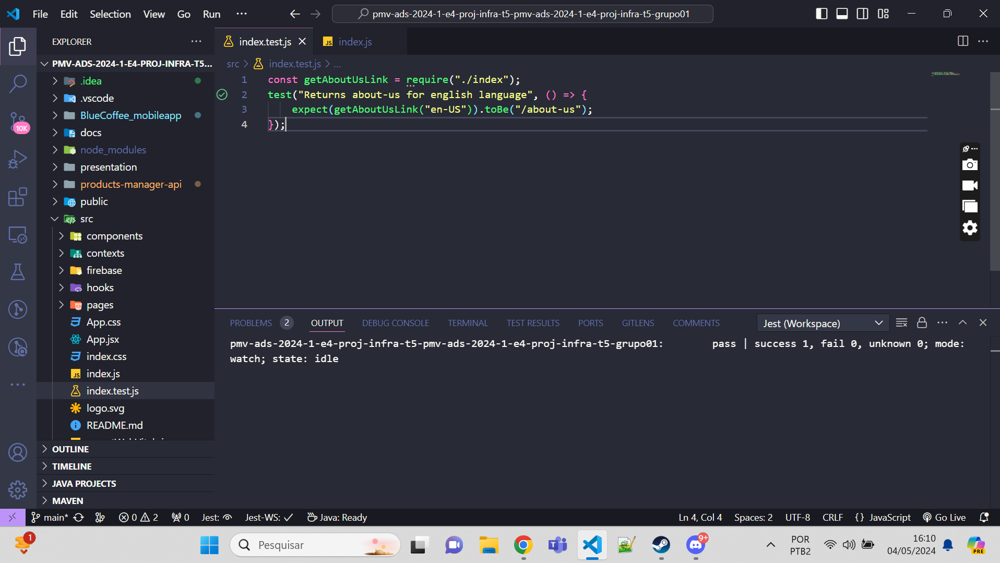

# Registro de Testes de Software

Pré-requisitos: <a href="3-Projeto de Interface.md"> Projeto de Interface</a>, <a href="8-Plano de Testes de Software.md"> Plano de Testes de Software</a>
## Teste de Unidade
 
Script: 
@SpringBootTest
public class MenuServiceTest {

    @Autowired
    private MenuService menuService;

    @Test
    public void testSaveAndGetMenuDetails() throws ExecutionException, InterruptedException {
        // Cria um novo menu
        Menu menu = new Menu();
        menu.setId(1); // Define um ID
        menu.setTitle("Café Espresso");

        // Salva o menu
        menuService.saveMenu(menu);

        // Obtém os detalhes do menu recém-salvo
        Menu retrievedMenu = menuService.getMenuDetails("1");

        // Verifica se os detalhes do menu não são nulos e correspondem ao menu salvo
        assertNotNull(retrievedMenu);
        assertEquals("Café Espresso", retrievedMenu.getTitle());
    }

    @Test
    public void testGetAllMenu() throws ExecutionException, InterruptedException {
        // Obtém todos os menus
        List<Menu> menuList = menuService.getAllMenu();

        // Verifica se a lista não é nula e contém pelo menos um menu
        assertNotNull(menuList);
        assert(menuList.size() > 0);
    }

    @Test
    public void testUpdateMenu() throws ExecutionException, InterruptedException {
        // Cria um novo menu
        Menu menu = new Menu();
        menu.setId(2);
        menu.setTitle("Cappuccino");

        // Salva o menu
        menuService.saveMenu(menu);

        // Atualiza o nome do menu
        menu.setTitle("Café Latte");
        menuService.updateMenu(menu);

        // Obtém os detalhes do menu atualizado
        Menu updatedMenu = menuService.getMenuDetails("2");

        // Verifica se o nome do menu foi atualizado corretamente
        assertNotNull(updatedMenu);
    }

    @Test
    public void testDeleteMenu() throws ExecutionException, InterruptedException {
        // Cria um novo menu
        Menu menu = new Menu();
        menu.setId(3);
        menu.setTitle("Café Americano");

        // Salva o menu
        menuService.saveMenu(menu);

        // Deleta o menu
        menuService.deleteMenu("3");

        // Tenta obter os detalhes do menu excluído
        Menu deletedMenu = menuService.getMenuDetails("3");

        // Verifica se o menu foi excluído com sucesso
        assertNull(deletedMenu);
    }
}

Resultado:
  

## Teste de Software

Alguns scripts foram utilizados para executar os testes unitários com Jest:

  
  
  
  
  
  
  
  
  
  

 

https://github.com/ICEI-PUC-Minas-PMV-ADS/pmv-ads-2024-1-e4-proj-infra-t5-pmv-ads-2024-1-e4-proj-infra-t5-grupo01/assets/110863711/a425a09a-38e4-43e4-b4c8-ea450b1857f3

https://github.com/ICEI-PUC-Minas-PMV-ADS/pmv-ads-2024-1-e4-proj-infra-t5-pmv-ads-2024-1-e4-proj-infra-t5-grupo01/assets/110863711/3dd82da0-22fd-422b-bda2-84e4fc656c3e

https://github.com/ICEI-PUC-Minas-PMV-ADS/pmv-ads-2024-1-e4-proj-infra-t5-pmv-ads-2024-1-e4-proj-infra-t5-grupo01/assets/110863711/07a3733f-eb7b-4133-bceb-0b897bce5434

## Avaliação

CT-01 - Cadastrar usuário:
A aplicação deve permitir que qualquer usuário possa se cadastrar no site.

Os usuários conseguiram se cadastrar com sucesso, e no caso de um eventual erro, uma mensagem aparece especificando exatamente o que o usuário precisa fazer para se cadastrar corretamente, facilitando para que o cliente não tenha tantas dúvidas ao usar o sistema.

CT-02 - Permitir que o funcionário crie anuncios de promoções:
Os funcionários conseguiram criar anúncios com êxito, e as informações dos anúncios foram exibidas corretamente na aplicação.

CT-03 - Permitir que o usuário faça um pedido:
Os usuários tiveram sucesso ao tentar fazer os pedidos, possibilitando que pudessem realizar vários pedidos.

CT-04 - Permitir que o usuário veja o cardápio
os usuários conseguiram ver o cardápio.

CT-05 - Permitir que o gestor gere o relatório de vendas
Ao visualizar o relatório, a aplicação foi capaz de informar os dados de vendas corretamente.

CT-06 - Permitir que o gestor gere o relatório de estoque
Ao visualizar o relatório, a aplicação foi capaz de informar os dados de estoque corretamente.

